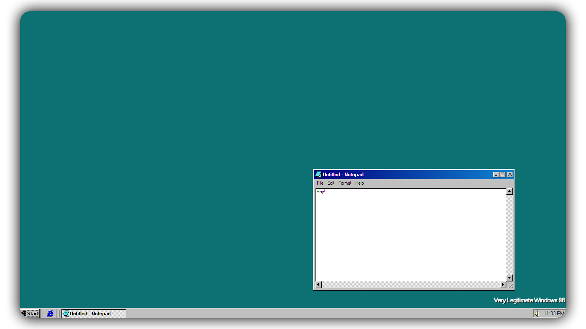

<h1 align="center">Webdows 98</h1>

  <strong>Windows 98 but built in React.</strong>
   
  <em>"You wouldn't react an OS"</em>

 

  

## Why?

Why not? In reality this was to help develop my React skills but could be useful to create gimmick applications.

## Technologies

- React
- Emotion (Styled Components)
- Tailwind

## Available Scripts

### `yarn start`

Runs the app in the development mode.\
Open [http://localhost:3000](http://localhost:3000) to view it in the browser.

The page will reload if you make edits.\
You will also see any lint errors in the console.

### `yarn test`

Launches the test runner in the interactive watch mode.\
See the section about [running tests](https://facebook.github.io/create-react-app/docs/running-tests) for more information.

### `yarn build`

Builds the app for production to the `build` folder.\
It correctly bundles React in production mode and optimizes the build for the best performance.

The build is minified and the filenames include the hashes.\
Your app is ready to be deployed!
